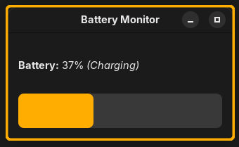

# Fedora Battery Monitor GUI

A simple GTK-based desktop application for Fedora Linux that monitors your battery status, displays the current level, and sends notifications with sound when the battery is running low. It features a system tray icon for easy access and background operation.

## Features

* **Real-time Battery Display:** Shows current battery percentage and status (Charging, Discharging, Full) in a clean Gtk window.
* **Visual Level Bar:** A progress bar visually indicates the current battery charge.
* **Configurable Low Battery Threshold:** Set your preferred percentage for low battery warnings (default is 30%).
* **Desktop Notifications:** Get timely desktop notifications when the battery reaches the low threshold.
* **Audible Alerts:** A sound plays along with the low battery notification.
* **System Tray Integration:** Uses AppIndicator3 for a system tray icon.
    * Tray icon dynamically reflects battery status (e.g., charging, low).
    * Tooltip shows current battery percentage and status.
    * Left-click to show/hide the main application window.
    * Right-click for a menu to show/hide the window or quit the application.
* **Runs on Fedora:** Designed with Fedora (GNOME, Wayland) in mind.

## Requirements

* Python 3
* PyGObject (for GTK3 and GLib)
* `python3-dbus` (for system communication)
* `libappindicator-gtk3` (for the system tray icon)
* `paplay` (typically from `pulseaudio-utils` or similar, for playing notification sounds)
* **For GNOME users (Recommended):** An active AppIndicator support extension (e.g., "AppIndicator and KStatusNotifierItem Support" from extensions.gnome.org) for the tray icon to be visible.

## Use

In `battery_monitor_gui.desktop` at Exec put your `battery_monitor_gui.py` location.

Then add `battery_monitor_gui.desktop` in your home under `.local/share/applications` folder.

 

## Support Me

If you find this application helpful, consider supporting me on Ko-fi!

